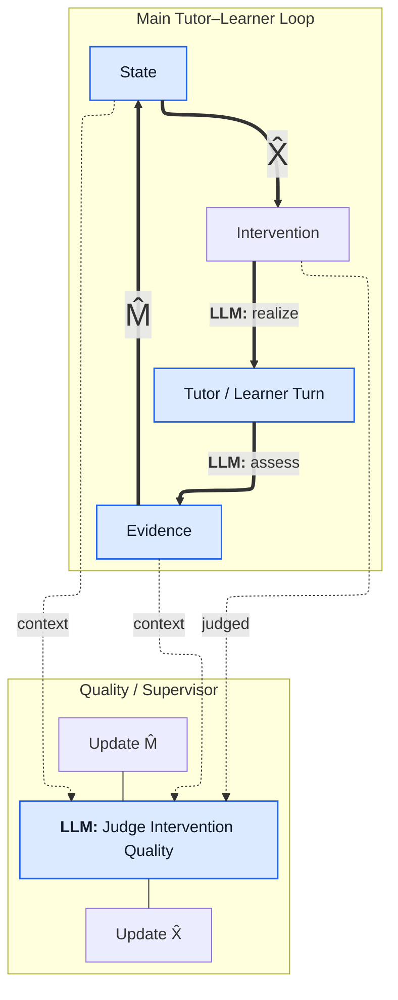

The architecture reads clearly as two layers:

$$
\text{Turn} \xrightarrow{\text{LLM assess}} \text{Evidence}
\xrightarrow{\hat M} \text{State}
\xrightarrow{\hat X} \text{Intervention}
\xrightarrow{\text{LLM realization}} \text{Turn}
$$

with the supervisor judging whether the selected intervention was appropriate in context.


```text
LLM: generate turn
```

That makes the separation very explicit.

A slightly refined version would therefore be:



The resulting interpretation is very clean:

* **LLM assess**: raw interaction → structured evidence
* **\(\hat M\)**: evidence → learner state
* **\(\hat X\)**: state → pedagogical intervention
* **LLM realize**: intervention → concrete tutor utterance
* **Supervisor**: checks whether the intervention was appropriate and adapts \(\hat M\) or \(\hat X\)

The main architectural boundary is then especially clear: **LLMs interpret and realize; \(M\) and \(X\) contain the adaptive pedagogical control logic.**
